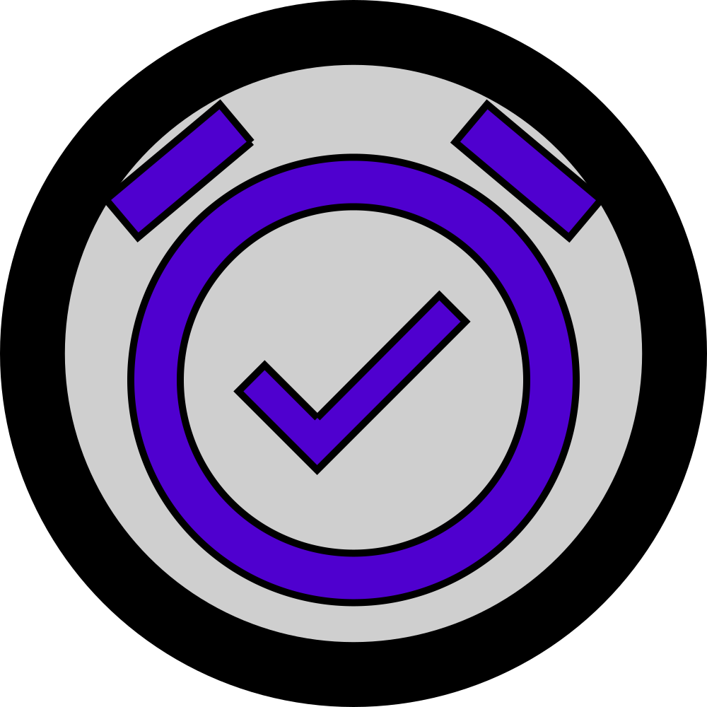

<p align="center">
 
</p>

<h1 align="center">push alarm backend client</h1>

<p align="center">
	See the frontend site source <a href='https://www.github.com/mrjackwills/push_alarm_frontend' target='_blank' rel='noopener noreferrer'>here</a>
</p>

<p align="center">
	Built in <a href='https://www.rust-lang.org/' target='_blank' rel='noopener noreferrer'>Rust</a>, using <a href='https://www.sqlite.org/' target='_blank' rel='noopener noreferrer'>SQLite</a>
</p>

## Required services

1) <a href='https://www.staticpi.com/' target='_blank' rel='noopener noreferrer'>staticPi</a> - the simple and secure messaging service

## Suggested software

1) <a href='https://www.docker.com/' target='_blank' rel='noopener noreferrer'>Docker</a> - container runner

Suggested locations for directories required by push alarm

| directory             | reason                      |
| --------------------- | --------------------------- |
| ```~/push_alarm.d/``` | Location of the application |

Files that are required by push alarm
| file            | reason                  |
| --------------- | ----------------------- |
| ```./.env```    | environmental variables |
| ```alarms.db``` | database                |

## Download

See <a href="https://github.com/mrjackwills/push_alarm_backend/releases" target='_blank' rel='noopener noreferrer'>releases</a>

*One should always verify <a href='https://github.com/mrjackwills/push_alarm_backend/blob/main/download.sh' target='_blank' rel='noopener noreferrer'>script content</a> before running in a shell*

```shell
curl https://raw.githubusercontent.com/mrjackwills/push_alarm_backend/main/download.sh | bash
```

## Run

use ```./run.sh``` in order to start, stop, or rebuild, the docker container - requires dialog to be installed on your system

## Tests

```bash
cargo test
```

